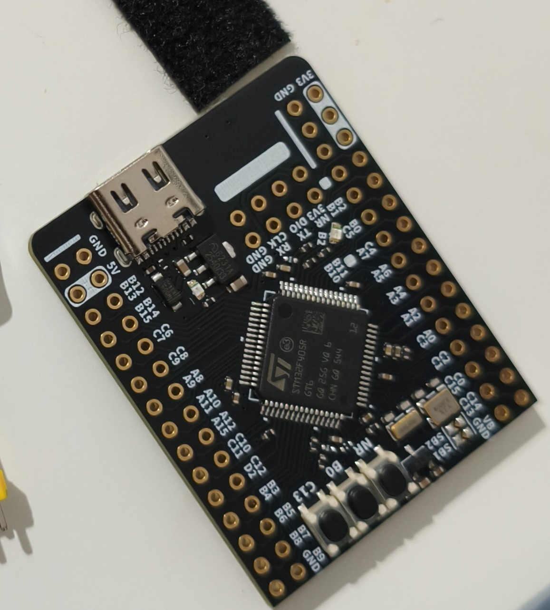
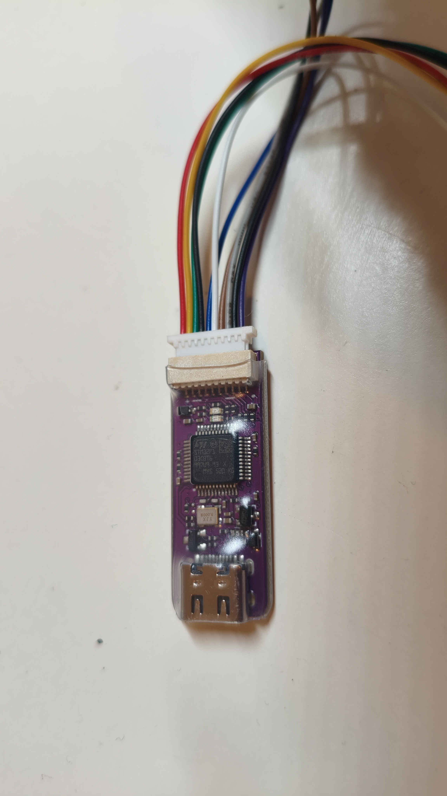
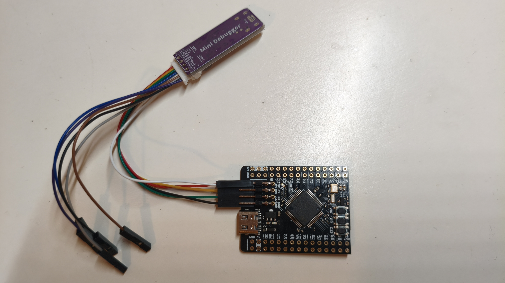

# STM32F4xx Peripheral Drivers

Bare-metal peripheral drivers for the STM32F405RGT6, written directly against
the reference manual — no HAL or LL libraries. The goal is to build a working
register-level driver for each major peripheral, understanding exactly what
each bit configures and why.

## Target Hardware

- **MCU:** STM32F405RGT6 (Arm Cortex-M4 + FPU, 1 MB Flash, 192 KB SRAM, 168 MHz, ART Accelerator)
- **Board:** [WeAct Studio STM32F4 Core Board](https://github.com/WeActStudio/WeActStudio.STM32F4_64Pin_CoreBoard)
- **Debugger:** [WeAct Studio MiniDebugger](https://github.com/WeActStudio/WeActStudio.MiniDebugger) (ST-Link V2.1, SWD)

## Hardware Setup

The MiniDebugger connects to the core board via SWD (SWDIO, SWCLK, GND, 3V3) —
no soldering required on either board.





## Toolchain

- STM32CubeIDE (project files included: `.cproject`, linker scripts)

## Project Structure

```text
.
├── drivers/
│   ├── Inc/                 # Custom peripheral headers (register maps, structs, APIs)
│   └── Src/                 # Custom peripheral driver implementations (.c files)
├── Inc/                     # Application-level headers (STM32CubeIDE generated)
├── Src/                     # Application-level code (main.c, syscalls.c)
├── Startup/                 # Startup assembly file
├── STM32F405RGTX_FLASH.ld   # Linker script — Flash execution
└── STM32F405RGTX_RAM.ld     # Linker script — RAM execution
```


## Driver Status

| Peripheral | Status |
| --- | --- |
| Memory map / base addresses | ✅ Done |
| GPIO | 🔲 Planned |
| RCC (clock control) | 🔲 Planned |
| SPI | 🔲 Planned |
| I2C | 🔲 Planned |
| USART | 🔲 Planned |
| Interrupts / NVIC | 🔲 Planned |

## Building

1. Open the project in STM32CubeIDE (`File → Open Projects from File System`).
2. Build with `Project → Build Project`.
3. Flash via `Run → Debug` (ST-Link).
